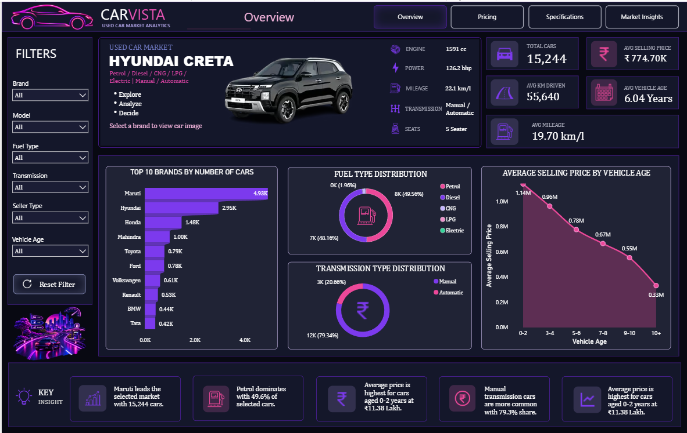
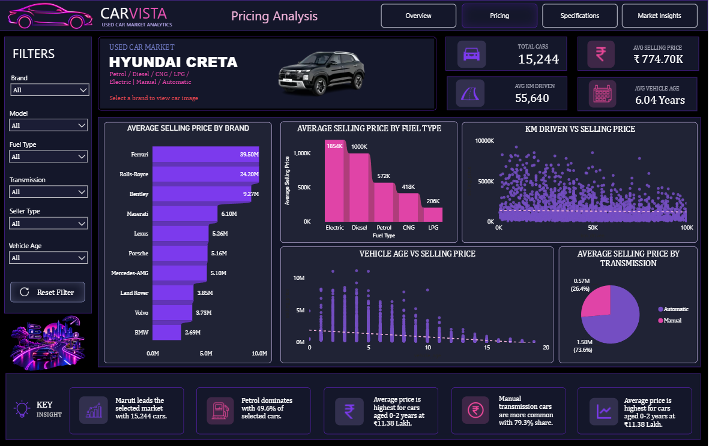
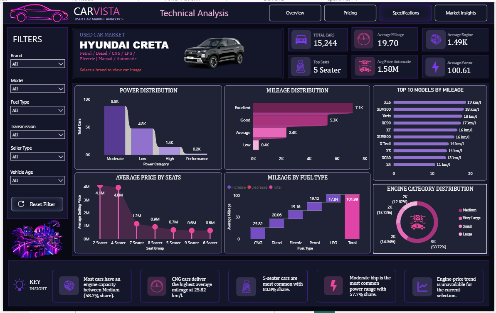
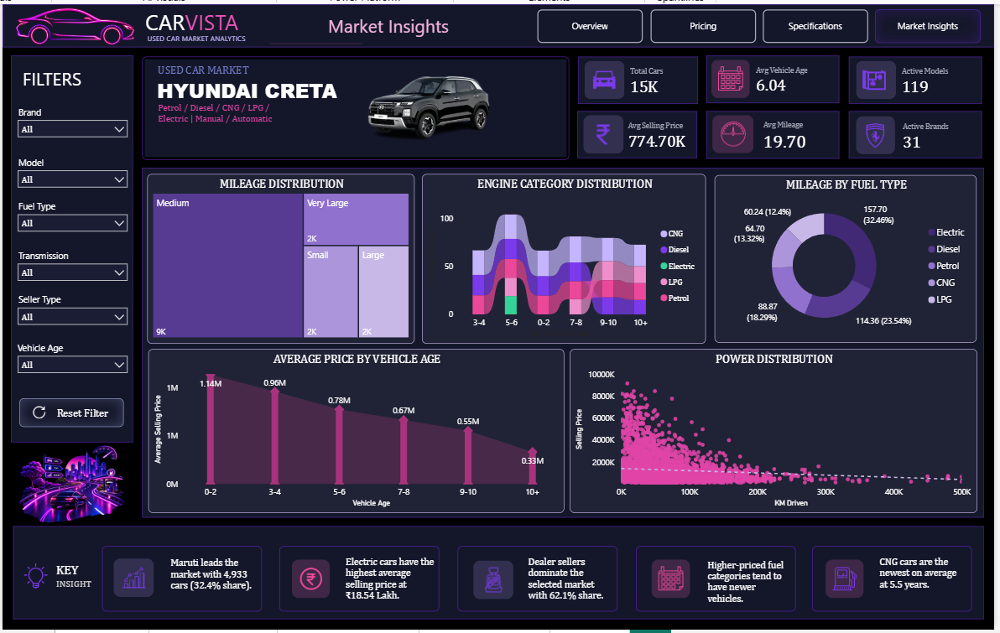

<div align="center">

# 🚗 CARVISTA — Used Car Market Analytics Dashboard

**An interactive Power BI dashboard turning raw used-car listings into decision-ready market insights.**


</div>

---

## 📌 Table of Contents

- [Overview](#-overview)
- [Objective](#-objective)
- [Dashboard Preview](#-dashboard-preview)
- [Dashboard Pages](#-dashboard-pages)
- [Interactive Features](#-interactive-features)
- [Tools & Technologies](#️-tools--technologies)
- [Repository Structure](#-repository-structure)
- [How to Use](#-how-to-use)
- [Key Learnings](#-key-learnings)
- [Future Improvements](#-future-improvements)
- [About This Project](#-about-this-project)

---

## 📊 Overview

**CARVISTA** is an interactive **Used Car Market Analytics Dashboard** built in **Power BI**, created as part of a hands-on **data science learning journey**.

The goal was to go beyond "just making charts" and understand how raw automotive data can be cleaned, modeled, and turned into a dashboard that actually answers business questions — the kind a buyer, seller, or dealer could use to make a decision.

The dashboard analyzes **pricing, vehicle specifications, mileage, fuel & transmission types, seller behaviour, vehicle age, brands, and models** across a real used-car dataset.

---

## 🎯 Objective

Build an interactive analytical dashboard that helps users:

- Understand overall used-car market performance at a glance
- Compare pricing across brands and models
- Analyze vehicle specifications and performance
- Study fuel-type and transmission preferences
- Understand how vehicle age affects selling price
- Identify meaningful market patterns and trends

---

## 🖼️ Dashboard Preview

> Add screenshots to `/assets/screenshots/` and update the paths below so they render on GitHub.

| Overview | Pricing Analysis |
|---|---|
|  |  |

| Specifications | Market Insights |
|---|---|
|  |  |

---

## 📄 Dashboard Pages

### 1️⃣ Overview
A high-level snapshot of the entire used-car market.
- Total Cars · Avg. Selling Price · Avg. KM Driven · Avg. Vehicle Age · Avg. Mileage
- Brand, Fuel Type & Transmission Distribution
- Vehicle Age vs. Selling Price trend

### 2️⃣ Pricing Analysis
Focused on pricing behaviour across the market.
- Selling Price by Brand
- Price distribution across vehicle age
- Fuel-based pricing analysis
- Price vs. KM Driven
- Pricing patterns across vehicle categories

### 3️⃣ Specifications
Technical characteristics of listed vehicles.
- Mileage & Engine Capacity Distribution
- Power Distribution
- Average Selling Price by Seat Configuration
- Mileage by Fuel Type
- Engine, Power & Mileage KPIs

### 4️⃣ Market Insights
Broader, market-level analysis.
- Market Share by Brand
- Seller Type Analysis
- Fuel Type Pricing
- Vehicle Age Patterns
- Dynamic insights that update with filter selection

---

## ⚡ Interactive Features

- 🔎 Dynamic Brand & Model selection with matching vehicle image
- 🔗 Synchronized slicers across all report pages
- 📌 Dynamic KPI cards
- 🧠 DAX-driven dynamic insight cards
- 🖱️ Interactive charts with cross-filtering
- ♻️ One-click "Reset Filter" functionality
- 🧭 Multi-page navigation bar

---

## 🛠️ Tools & Technologies

| Tool | Purpose |
|---|---|
| **Power BI Desktop** | Dashboard development & visualization |
| **Power Query** | Data cleaning & transformation (ETL) |
| **DAX** | Measures, KPIs & dynamic insight logic |
| **CSV Dataset** | Raw data source |
| **GitHub** | Version control & project documentation |

---

## 📁 Repository Structure

```
CARVISTA-Used-Car-Analytics/
├── Car Dekho Dataset.pbix       # Power BI dashboard file
├── cardekho_dataset.csv         # Dataset used for analysis
├── assets/
│   └── screenshots/             # Dashboard preview images
├── docs/
│   └── CARVISTA_Documentation.pdf   # Full project write-up
└── README.md
```

---

## ▶️ How to Use

1. Clone or download this repository.
   ```bash
   git clone https://github.com/<your-username>/CARVISTA-Used-Car-Analytics.git
   ```
2. Open **`Car Dekho Dataset.pbix`** in [Power BI Desktop](https://powerbi.microsoft.com/desktop/) (free).
3. Use the filter panel on the left (Brand, Model, Fuel Type, Transmission, Seller Type, Vehicle Age) to explore the data.
4. Navigate between **Overview → Pricing → Specifications → Market Insights** using the top navigation bar.

---

## 💡 Key Learnings

This project pushed me to focus less on *how many* visuals I could add, and more on *what question* each one answers.

Hands-on skills strengthened along the way:

- Data cleaning & transformation (Power Query)
- Data modeling
- DAX measures & dynamic calculations
- KPI development
- Slicer interactions & cross-filtering
- Multi-page dashboard navigation
- Data visualization best practices
- Dashboard UI/UX design

It also helped me understand how Power BI's components — data model, DAX, visuals, and slicers — work together to create one connected analytical experience rather than a set of isolated charts.

---

## 🚀 Future Improvements

- [ ] Additional advanced DAX analysis (YoY comparisons, ranking measures)
- [ ] More granular market segmentation
- [ ] Drill-through pages for brand/model deep-dives
- [ ] Enhanced dynamic insight narratives
- [ ] Further performance optimization for large datasets

---

## 👩‍💻 About This Project

Built by **Pathan Tarannum** as part of an ongoing **Data Science learning journey** — currently strengthening skills in **Power BI, SQL, Excel, and Python** through hands-on projects like this one.

📄 Full project documentation: [`docs/CARVISTA_Documentation.pdf`](docs/CARVISTA_Documentation.pdf)

---

<div align="center">

⭐ **If you found this project useful, consider giving it a star — feedback is always welcome!**

</div>
